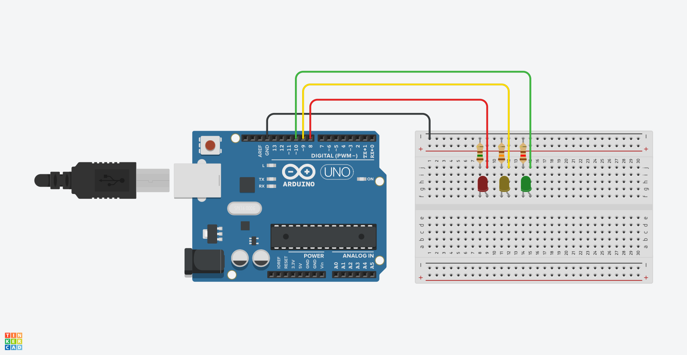
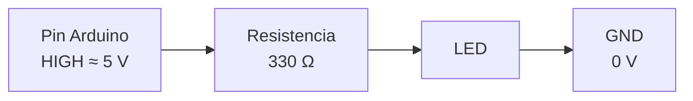
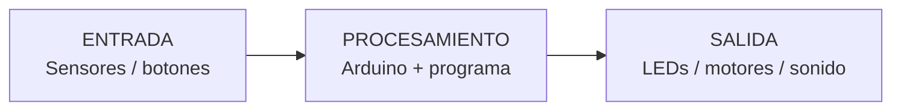
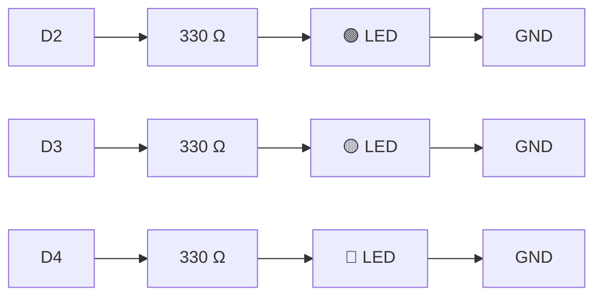
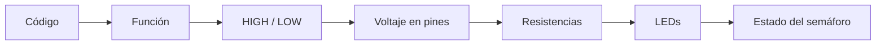

# Clase 1 · Introducción a Arduino: señales, bits y semáforo 🚦

> **Objetivos de la clase:** Comprender la relación entre fenómenos eléctricos con instrucciones de programación.

---

## 🎯 Resultados de aprendizaje

Al finalizar la clase, las y los estudiantes podrán:

1. Identificar pines **digitales**, **analógicos**, **5V/3.3V** y **GND** en una placa Arduino.
2. Distinguir entre **voltaje**, **corriente** y **resistencia**.
3. Aplicar la **Ley de Ohm** para comprender por qué usamos una resistencia con un LED.
4. Explicar la diferencia entre una **señal digital** y una **señal analógica**.
5. Comprender qué es un **bit** y cómo se relaciona con la representación digital de información.
6. Reconocer la estructura básica de un programa Arduino: `void setup()` y `void loop()`.
7. Utilizar `pinMode()`, `digitalWrite()` y `delay()`.
8. Cablear y programar tres LEDs para construir un **semáforo vial**.
9. Extender el ejercicio hacia un **semáforo vial + peatonal**.

---


# 📦 Materiales

- 1 × Arduino UNO
- 1 × cable USB AB
- 1 × protoboard
- 1 × LED rojo
- 1 × LED amarillo
- 1 × LED verde
- 3 × resistencias (determinaremos las resistencias en clases)
- jumpers M–M

Para la extensión peatonal:

- 1 × LED rojo adicional
- 1 × LED verde adicional
- 2 × resistencias

---

# 🗺️ Ruta de la clase

La clase sigue esta secuencia:

```text
ELECTRICIDAD
    ↓
Voltaje · Corriente · Resistencia
    ↓
Ley de Ohm
    ↓
Señales analógicas y digitales
    ↓
Bits
    ↓
Arduino como sistema de entrada → procesamiento → salida
    ↓
Estructura de un sketch
setup() + loop()
    ↓
digitalWrite()
    ↓
LED
    ↓
3 LEDs
    ↓
SEMÁFORO
```

---

# 1. ⚡ Antes de Arduino: ¿qué ocurre eléctricamente?

Antes de programar necesitamos comprender tres conceptos.

## Voltaje — V

El **voltaje** es una diferencia de potencial eléctrico.

Puede pensarse, de manera simplificada, como la fuerza que permite impulsar el movimiento de carga eléctrica a través de un circuito.

Se mide en:

```text
Voltios → V
```

En una Arduino UNO / UNO R4 encontraremos, entre otros:

```text
5V
3.3V
GND
```

`GND` es nuestra referencia de **0 V**.

---

## Corriente — I

La **corriente eléctrica** representa el flujo de carga que circula por el circuito.

Se mide en:

```text
Amperes → A
Miliamperes → mA

1 A = 1000 mA
```

Un LED necesita una corriente limitada. Si dejamos circular demasiada corriente podemos dañarlo y también sobrecargar la salida del microcontrolador.

---

## Resistencia — R

Una resistencia se opone al paso de corriente.

Se mide en:

```text
Ohms → Ω
```

En nuestro circuito usaremos una resistencia de:

```text
330 Ω
```

para limitar la corriente que pasa por cada LED.

---

# 2. 🧮 Ley de Ohm

Voltaje, corriente y resistencia se relacionan mediante la **Ley de Ohm**:

```text
V = I × R
```

También podemos escribir:

```text
I = V / R
```

y:

```text
R = V / I
```

## Ejemplo con un LED

Supongamos:

```text
Salida Arduino = 5 V
Caída aproximada LED rojo = 2 V
Resistencia = 330 Ω
```

El voltaje aproximado sobre la resistencia será:

```text
5 V - 2 V = 3 V
```

Aplicamos Ley de Ohm:

```text
I = V / R

I = 3 / 330

I ≈ 0.009 A
```

Es decir:

```text
≈ 9 mA
```

La resistencia limita la corriente y protege el LED.

### Circuito



> **Idea clave:** la resistencia no está ahí porque Arduino la necesite para ejecutar el programa. Está ahí porque el **circuito eléctrico** necesita limitar la corriente.

---

# 3. 〰️ Señal analógica y señal digital

## Señal analógica

Una señal analógica puede asumir **muchos valores dentro de un rango**.

Ejemplos:

- posición de un potenciómetro;
- intensidad de luz;
- presión;
- temperatura;
- distancia medida por determinados sensores;
- señal de audio.

Podemos imaginarla así:

```text
Voltaje

5V |             ╭───╮
   |          ╭──╯   ╰╮
   |      ╭───╯       ╰──╮
   |  ╭───╯               ╰─
0V +----------------------------→ tiempo
```

No existen solamente dos estados: aparecen valores intermedios.

---

## Señal digital

En un sistema digital nos interesa distinguir estados discretos.

Para comenzar podemos pensar en dos estados:

```text
LOW  → 0
HIGH → 1
```

En una Arduino UNO / UNO R4, una salida digital puede representarse didácticamente como:

```text
LOW  → aproximadamente 0 V
HIGH → aproximadamente 5 V
```

La señal física sigue siendo **voltaje**. Lo digital está en cómo esos niveles eléctricos son **interpretados como estados**.

```text
Voltaje

5V | ┌──────┐        ┌──────┐
   | │      │        │      │
0V |─┘      └────────┘      └────→ tiempo

      HIGH      LOW      HIGH
        1        0         1
```

### La idea más importante

```text
ELECTRICIDAD                  INFORMACIÓN

~5 V         ─────────────→      HIGH
                                  1
                                  ON
                                  TRUE

~0 V         ─────────────→      LOW
                                  0
                                  OFF
                                  FALSE
```

Arduino conecta ambos mundos.

---

# 4. 0️⃣1️⃣ ¿Qué es un bit?

Un **bit** es la unidad mínima de información digital.

Puede tener dos estados:

```text
0
1
```

Por eso:

```text
1 bit → 2¹ → 2 estados
```

Al combinar bits podemos representar más estados:

| Bits | Estados posibles | Rango numérico |
|---:|---:|---:|
| 1 | 2 | 0–1 |
| 2 | 4 | 0–3 |
| 3 | 8 | 0–7 |
| 4 | 16 | 0–15 |
| 8 | 256 | 0–255 |
| 10 | 1024 | 0–1023 |
| 12 | 4096 | 0–4095 |
| 14 | 16384 | 0–16383 |

La regla general es:

```text
cantidad de estados = 2^bits
```

> **Más bits significa más niveles disponibles y, por tanto, mayor resolución. No significa necesariamente un rango de voltaje mayor.**

---

# 5. 🔢 ¿Cómo entiende Arduino una señal analógica?

Arduino es un sistema digital.

Para medir un voltaje analógico utiliza un:

```text
ADC
Analog-to-Digital Converter
Conversor Analógico-Digital
```

El ADC transforma un voltaje en un número.

En Arduino UNO R4, `analogRead()` utiliza por defecto una resolución de **10 bits**:

```text
2^10 = 1024 niveles
```

Por eso obtenemos números:

```text
0 ... 1023
```

Si utilizamos como referencia 5 V, podemos visualizar aproximadamente:

```text
Voltaje         Valor ADC

0 V      ───→      0

1.25 V   ───→    ~256

2.50 V   ───→    ~512

3.75 V   ───→    ~767

5 V      ───→     1023
```

En Arduino UNO R4 la resolución del ADC también puede configurarse a **12 o 14 bits** mediante `analogReadResolution()`.

## Demostración opcional con potenciómetro

```cpp
const int POT = A0;

void setup() {
  Serial.begin(9600);
}

void loop() {
  int valor = analogRead(POT);

  Serial.print("ADC: ");
  Serial.println(valor);

  delay(100);
}
```

Al girar el potenciómetro, el voltaje cambia y el ADC lo representa mediante números.

> Esta demostración no es necesaria para construir el semáforo, pero permite entender la diferencia entre **medir una magnitud analógica** y **controlar una salida digital**.

---

# 6. 🧠 Arduino como sistema

Podemos pensar cualquier proyecto Arduino mediante tres bloques:



En nuestro primer semáforo todavía no necesitamos sensores.

Por lo tanto:

```text
PROGRAMA
   ↓
ARDUINO
   ↓
PINES DIGITALES
   ↓
LEDs
```

---

# 7. 🔌 Reconociendo la placa

Antes de programar, localizar físicamente:

## Alimentación

```text
5V
3.3V
GND
```

## Pines digitales

```text
D0 ... D13
```

Pueden utilizarse como entradas o salidas digitales.

Para esta clase utilizaremos:

```text
D2 → LED verde
D3 → LED amarillo
D4 → LED rojo
```

## Pines analógicos

```text
A0 ... A5
```

Permiten medir señales analógicas mediante el ADC.

---

# 8. 💻 ¿Qué es un sketch?

Un programa escrito para Arduino suele denominarse **sketch**.

Un sketch básico contiene dos funciones fundamentales:

```cpp
void setup() {

}

void loop() {

}
```

Arduino ejecuta estas funciones automáticamente.

---

# 9. 🧩 ¿Qué significa `void`?

Void indica que una función no devuelve ningún valor al terminar de ejecutarse. Esta palabra suele aparecer desde el primer programa Arduino:

```cpp
void setup()
```
Se ejecuta una sola vez cuando enciendes la placa o presionas el botón de reinicio.
y:

```cpp
void loop()
```
Se ejecuta en bucle de forma continua e infinita inmediatamente después de que termina el setup.

pero conviene entender qué significa.

## Una función

Una **función** es un bloque de instrucciones que realiza una tarea.

Podemos imaginarla como:

```text
FUNCIÓN
┌────────────────────┐
│ instrucciones      │
│ instrucciones      │
│ instrucciones      │
└────────────────────┘
```

## `void`

`void` indica que la función **no devuelve un valor**.

Por ejemplo:

```cpp
void encenderLed() {
  digitalWrite(2, HIGH);
}
```

La función realiza una acción:

```text
encender el LED
```

pero no entrega un número, texto u otro valor como resultado.

Por eso utilizamos:

```cpp
void
```

Podemos leer:

```cpp
void encenderLed()
```

como:

> “Existe una función llamada `encenderLed` que ejecuta una tarea y no devuelve ningún valor”.

---

# 10. 🔁 `setup()` y `loop()`

## `void setup()`

```cpp
void setup() {

}
```

Arduino ejecuta `setup()` **una vez** al encenderse, reiniciarse o comenzar la ejecución del sketch.

Se utiliza principalmente para realizar configuraciones iniciales.

Por ejemplo:

```cpp
void setup() {
  pinMode(2, OUTPUT);
}
```

Estamos indicando:

```text
PIN 2 → será una SALIDA
```

---

## `void loop()`

Después de `setup()`, Arduino ejecuta:

```cpp
void loop() {

}
```

una y otra vez.

Conceptualmente:

```text
ENCENDER ARDUINO
      ↓
   setup()
      ↓
    loop()
      ↑
      └──────── repetir
```

Ejemplo:

```cpp
void loop() {
  digitalWrite(2, HIGH);
  delay(1000);

  digitalWrite(2, LOW);
  delay(1000);
}
```

El LED se enciende y apaga indefinidamente porque `loop()` vuelve a comenzar cada vez que llega al final.

---

# 11. 🧱 Anatomía mínima del código

Tomemos este ejemplo:

```cpp
const int LED = 2;

void setup() {
  pinMode(LED, OUTPUT);
}

void loop() {
  digitalWrite(LED, HIGH);
  delay(1000);

  digitalWrite(LED, LOW);
  delay(1000);
}
```

## `const int LED = 2;`

Creamos un nombre para representar el pin.

```text
LED → pin 2
```

`const` indica que no queremos cambiar ese valor durante el programa.

`int` indica que almacenaremos un número entero.

---

## `pinMode()`

```cpp
pinMode(LED, OUTPUT);
```

Configura el pin para funcionar como salida.

```text
INPUT  → Arduino recibe información
OUTPUT → Arduino entrega/controla una señal
```

---

## `digitalWrite()`

```cpp
digitalWrite(LED, HIGH);
```

establece la salida digital en estado alto.

```cpp
digitalWrite(LED, LOW);
```

establece la salida digital en estado bajo.

Podemos conectar código y electricidad:

```text
digitalWrite(pin, HIGH)
          ↓
       HIGH / 1
          ↓
      ~5 V en pin
          ↓
       corriente
          ↓
    resistencia 330 Ω
          ↓
          LED
          ↓
          GND
```

---

## `delay()`

```cpp
delay(1000);
```

detiene temporalmente la ejecución.

La unidad son **milisegundos**:

```text
1000 ms = 1 segundo
500 ms  = 0.5 segundos
4000 ms = 4 segundos
```

---

# 12. 🧪 Ejercicio 1 · Un LED

## Cableado

```text
D2
 │
 ├── resistencia 330 Ω
 │
 ├── ánodo LED (+)
 │
 LED
 │
 └── cátodo LED (-)
 │
GND
```

En un LED convencional:

```text
pata larga  → ánodo    → +
pata corta  → cátodo   → -
```

## Código

```cpp
const int LED = 2;

void setup() {
  pinMode(LED, OUTPUT);
}

void loop() {
  digitalWrite(LED, HIGH);
  delay(1000);

  digitalWrite(LED, LOW);
  delay(1000);
}
```

### Preguntas antes de cargar el código

1. ¿Qué instrucciones se ejecutan una sola vez?
2. ¿Qué instrucciones se repiten?
3. ¿Qué ocurriría si cambiamos `1000` por `100`?
4. ¿Qué ocurriría si eliminamos la resistencia?
5. ¿Qué representa físicamente `HIGH`?

---

# 13. 🚥 Ejercicio 2 · Tres LEDs

Ahora ampliamos el circuito:

| LED | Pin | Resistencia |
|---|---:|---:|
| 🟢 Verde | D2 | 330 Ω |
| 🟡 Amarillo | D3 | 330 Ω |
| 🔴 Rojo | D4 | 330 Ω |

Cada LED necesita **su propia resistencia**.



## Código de prueba

```cpp
const int LED_VERDE = 2;
const int LED_AMARILLO = 3;
const int LED_ROJO = 4;

void setup() {
  pinMode(LED_VERDE, OUTPUT);
  pinMode(LED_AMARILLO, OUTPUT);
  pinMode(LED_ROJO, OUTPUT);
}

void loop() {

  digitalWrite(LED_VERDE, HIGH);
  digitalWrite(LED_AMARILLO, LOW);
  digitalWrite(LED_ROJO, LOW);

  delay(1000);

  digitalWrite(LED_VERDE, LOW);
  digitalWrite(LED_AMARILLO, HIGH);
  digitalWrite(LED_ROJO, LOW);

  delay(1000);

  digitalWrite(LED_VERDE, LOW);
  digitalWrite(LED_AMARILLO, LOW);
  digitalWrite(LED_ROJO, HIGH);

  delay(1000);
}
```

La pregunta ahora es:

> ¿Cómo transformamos este ejercicio en un sistema con una lógica reconocible?

La respuesta es el **semáforo**.

---

# 14. 🚦 Proyecto de clase · Semáforo vial

## Comportamiento esperado

El semáforo tendrá tres estados:

| Estado | Verde | Amarillo | Rojo | Duración |
|---|---|---|---|---:|
| Avanzar | HIGH | LOW | LOW | 4 s |
| Precaución | LOW | HIGH | LOW | 1 s |
| Detener | LOW | LOW | HIGH | 4 s |

La secuencia será:

```text
🟢 VERDE
   ↓
🟡 AMARILLO
   ↓
🔴 ROJO
   ↓
🟢 VERDE
   ↓
   ...
```

Esto funciona naturalmente con `loop()` porque un semáforo es un sistema **cíclico**.

---

# 15. Primera versión del semáforo

```cpp
const int LED_VERDE = 2;
const int LED_AMARILLO = 3;
const int LED_ROJO = 4;

void setup() {

  pinMode(LED_VERDE, OUTPUT);
  pinMode(LED_AMARILLO, OUTPUT);
  pinMode(LED_ROJO, OUTPUT);

}

void loop() {

  // VERDE
  digitalWrite(LED_VERDE, HIGH);
  digitalWrite(LED_AMARILLO, LOW);
  digitalWrite(LED_ROJO, LOW);

  delay(4000);


  // AMARILLO
  digitalWrite(LED_VERDE, LOW);
  digitalWrite(LED_AMARILLO, HIGH);
  digitalWrite(LED_ROJO, LOW);

  delay(1000);


  // ROJO
  digitalWrite(LED_VERDE, LOW);
  digitalWrite(LED_AMARILLO, LOW);
  digitalWrite(LED_ROJO, HIGH);

  delay(4000);

}
```

Antes de cargarlo a Arduino, seguir el programa manualmente:

```text
setup()
  ↓
configura D2, D3 y D4
  ↓
loop()
  ↓
verde durante 4 s
  ↓
amarillo durante 1 s
  ↓
rojo durante 4 s
  ↓
fin de loop()
  ↓
vuelve al comienzo
```

---

# 16. 🧩 Mejorando el programa: nuestras propias funciones `void`

Ya sabemos que una función `void` ejecuta una tarea y no devuelve un valor.

Podemos organizar el semáforo utilizando funciones propias:

```cpp
void verde()
void amarillo()
void rojo()
```

Cada función representará un **estado del sistema**.

## Código organizado

```cpp
const int LED_VERDE = 2;
const int LED_AMARILLO = 3;
const int LED_ROJO = 4;

void setup() {

  pinMode(LED_VERDE, OUTPUT);
  pinMode(LED_AMARILLO, OUTPUT);
  pinMode(LED_ROJO, OUTPUT);

}

void loop() {

  verde();
  delay(4000);

  amarillo();
  delay(1000);

  rojo();
  delay(4000);

}


void verde() {

  digitalWrite(LED_VERDE, HIGH);
  digitalWrite(LED_AMARILLO, LOW);
  digitalWrite(LED_ROJO, LOW);

}


void amarillo() {

  digitalWrite(LED_VERDE, LOW);
  digitalWrite(LED_AMARILLO, HIGH);
  digitalWrite(LED_ROJO, LOW);

}


void rojo() {

  digitalWrite(LED_VERDE, LOW);
  digitalWrite(LED_AMARILLO, LOW);
  digitalWrite(LED_ROJO, HIGH);

}
```

Ahora `loop()` permite **leer el comportamiento** del semáforo con mucha facilidad:

```cpp
verde();
delay(4000);

amarillo();
delay(1000);

rojo();
delay(4000);
```

Esta organización conecta directamente programación y diseño del sistema:

```text
FUNCIÓN             ESTADO FÍSICO

verde()      ───→   🟢 encendido
amarillo()   ───→   🟡 encendido
rojo()       ───→   🔴 encendido
```

> [!TIP]
> Esta es una buena oportunidad para mostrar que programar no consiste solamente en escribir instrucciones: también implica **organizar comportamientos y darles nombres**.

---

# 17. 🧠 Modelo completo de lo que está ocurriendo

Cuando Arduino ejecuta:

```cpp
verde();
```

ocurre una cadena completa:

```text
CÓDIGO
  ↓
función verde()
  ↓
digitalWrite()
  ↓
HIGH / LOW
  ↓
niveles eléctricos en los pines
  ↓
corriente limitada por resistencias
  ↓
LEDs
  ↓
estado visible del semáforo
```

Podemos resumirlo así:



---

# 18. 🚶 Desafío · Semáforo vial + peatonal

Una vez funcionando el semáforo vial, agregar:

```text
LED peatonal rojo  → D5
LED peatonal verde → D6
```

con una resistencia de **330 Ω por LED**.


## Reglas

Cuando los vehículos avanzan:

```text
Vehicular verde  → ON
Peatonal rojo    → ON
```

Cuando los vehículos están en amarillo:

```text
Vehicular amarillo → ON
Peatonal rojo      → ON
```

Cuando los vehículos están detenidos:

```text
Vehicular rojo   → ON
Peatonal verde   → ON
```

## Tabla de estados

| Estado | Veh. verde | Veh. amarillo | Veh. rojo | Peat. verde | Peat. rojo |
|---|---|---|---|---|---|
| Vehículos avanzan | HIGH | LOW | LOW | LOW | HIGH |
| Precaución | LOW | HIGH | LOW | LOW | HIGH |
| Peatones cruzan | LOW | LOW | HIGH | HIGH | LOW |

### Objetivo

Antes de escribir el código, intentar transformar cada fila de la tabla en una función:

```cpp
void vehiculosAvanzan()
void precaucion()
void peatonesCruzan()
```

<details>
<summary><strong>Mostrar una posible solución</strong></summary>

```cpp
const int VEH_VERDE = 2;
const int VEH_AMARILLO = 3;
const int VEH_ROJO = 4;

const int PEAT_ROJO = 5;
const int PEAT_VERDE = 6;

void setup() {

  pinMode(VEH_VERDE, OUTPUT);
  pinMode(VEH_AMARILLO, OUTPUT);
  pinMode(VEH_ROJO, OUTPUT);

  pinMode(PEAT_ROJO, OUTPUT);
  pinMode(PEAT_VERDE, OUTPUT);

}

void loop() {

  vehiculosAvanzan();
  delay(4000);

  precaucion();
  delay(1000);

  peatonesCruzan();
  delay(4000);

}


void vehiculosAvanzan() {

  digitalWrite(VEH_VERDE, HIGH);
  digitalWrite(VEH_AMARILLO, LOW);
  digitalWrite(VEH_ROJO, LOW);

  digitalWrite(PEAT_VERDE, LOW);
  digitalWrite(PEAT_ROJO, HIGH);

}


void precaucion() {

  digitalWrite(VEH_VERDE, LOW);
  digitalWrite(VEH_AMARILLO, HIGH);
  digitalWrite(VEH_ROJO, LOW);

  digitalWrite(PEAT_VERDE, LOW);
  digitalWrite(PEAT_ROJO, HIGH);

}


void peatonesCruzan() {

  digitalWrite(VEH_VERDE, LOW);
  digitalWrite(VEH_AMARILLO, LOW);
  digitalWrite(VEH_ROJO, HIGH);

  digitalWrite(PEAT_VERDE, HIGH);
  digitalWrite(PEAT_ROJO, LOW);

}
```

</details>

---

# 19. ⭐ Desafíos opcionales

Una vez terminado el ejercicio principal:

### Nivel 1 · Cambiar tiempos

Modificar las duraciones:

```cpp
delay(4000);
delay(1000);
```

¿Qué cambios producen en el comportamiento?

---

### Nivel 2 · Peatonal intermitente

Hacer que el LED verde peatonal parpadee antes de volver a rojo.

Pensar:

```text
HIGH
↓
delay()
↓
LOW
↓
delay()
↓
repetir
```

---

### Nivel 3 · Pulsador

Agregar un pulsador para solicitar el cruce peatonal.

Esto introducirá un nuevo concepto:

```text
ENTRADA → PROCESAMIENTO → SALIDA
```

```text
pulsador
   ↓
digitalRead()
   ↓
Arduino decide
   ↓
semáforo
```

Este ejercicio puede desarrollarse posteriormente con `if`, variables y lógica condicional.

---

# 20. ⚠️ PWM no es necesariamente una salida analógica

Algunas placas permiten utilizar:

```cpp
analogWrite()
```

en determinados pines.

En pines PWM, Arduino genera normalmente una señal digital que cambia muy rápidamente entre:

```text
HIGH
LOW
```

variando el porcentaje de tiempo que permanece encendida.

Por ejemplo:

```text
25 % duty cycle

5V ┌─┐   ┌─┐   ┌─┐
   │ │   │ │   │ │
0V ┘ └───┘ └───┘ └───
```

Esto permite controlar, por ejemplo, el brillo aparente de un LED.

> En Arduino UNO R4 existe además un **DAC real en A0**, capaz de generar una salida analógica. No debemos confundir DAC y PWM.

Para el semáforo de esta clase no necesitamos PWM: cada LED utilizará solamente los estados `HIGH` y `LOW`.

---

# 21. 🔍 Solución de problemas

## El LED no enciende

Revisar:

- orientación del LED;
- conexión a GND;
- número de pin;
- resistencia;
- continuidad de la protoboard;
- que el pin esté configurado como `OUTPUT`.

---

## El LED está conectado al revés

Los LEDs tienen polaridad.

```text
Ánodo   → positivo / pin (pata larga)
Cátodo  → GND (pata corta)
```

Si está invertido normalmente no encenderá.

---

## El LED ilumina muy poco

Verificar el valor de la resistencia.

```text
330 Ω    → adecuado para esta actividad
330 kΩ   → demasiado grande
```

No confundir:

```text
Ω  → ohms
kΩ → miles de ohms
```

---

## El LED ilumina demasiado o se calienta

Desconectar el circuito y comprobar que el LED tenga una resistencia limitadora.

Nunca conectar intencionalmente un LED directamente entre una salida de 5 V y GND sin calcular o limitar la corriente.

---

## El código compila pero el comportamiento es incorrecto

Comprobar:

1. ¿Coinciden los números de pin del código con el circuito?
2. ¿Todos los LEDs tienen GND?
3. ¿Las variables corresponden al color correcto?
4. ¿Existe más de un LED en `HIGH` cuando no debería?
5. ¿Los `delay()` están ubicados después del estado correspondiente?

---

# 22. ❓ Preguntas de cierre

Al terminar la clase, intentar responder sin mirar el código:

1. ¿Cuál es la diferencia entre voltaje y corriente?
2. ¿Por qué usamos una resistencia con un LED?
3. ¿Qué relación describe la Ley de Ohm?
4. ¿Cuál es la diferencia entre una señal analógica y una digital?
5. ¿Qué es un bit?
6. ¿Cuántos estados podemos representar con 8 bits?
7. ¿Por qué un ADC de 10 bits entrega valores entre 0 y 1023?
8. ¿Qué significa `HIGH` físicamente?
9. ¿Qué significa `void`?
10. ¿Cuál es la diferencia entre `setup()` y `loop()`?
11. ¿Para qué sirve `pinMode()`?
12. ¿Qué hace `digitalWrite()`?
13. ¿Por qué el semáforo vuelve a comenzar después del rojo?

---

# 23. 🧾 Resumen

```text
VOLTAJE
  │
  ├── puede variar → señal analógica
  │
  └── puede interpretarse por estados → señal digital
                                      │
                                      ↓
                                    0 / 1
                                      │
                                      ↓
                                    BITS
                                      │
                                      ↓
                                   ARDUINO
                                      │
                    ┌─────────────────┴─────────────────┐
                    ↓                                   ↓
                 setup()                             loop()
             ocurre una vez                      se repite
                    │                                   │
                    └─────────────────┬─────────────────┘
                                      ↓
                                digitalWrite()
                                      ↓
                                  HIGH / LOW
                                      ↓
                                  PIN DIGITAL
                                      ↓
                                  RESISTENCIA
                                      ↓
                                     LED
                                      ↓
                                  SEMÁFORO
```

La idea central de la clase es comprender que Arduino funciona como un puente entre:

```text
FENÓMENOS FÍSICOS
        ↕
ELECTRICIDAD
        ↕
INFORMACIÓN
        ↕
CÓDIGO
```

---
